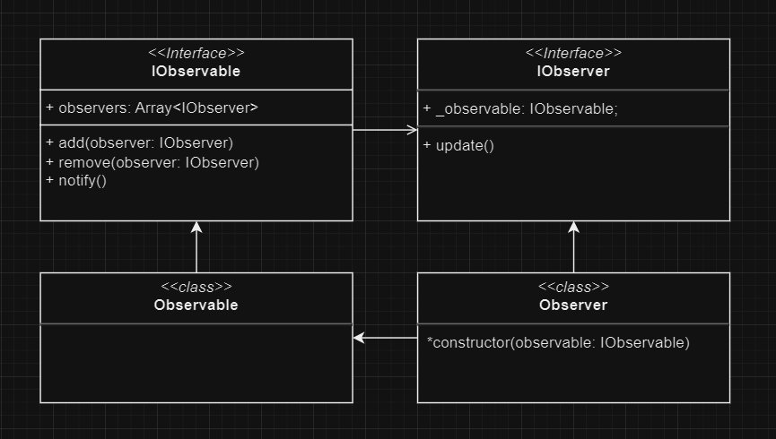

# Observer Pattern

Esse pattern server para quando precisamos notificar 1 ou mais elementos de que o estado de um outro elemento mudou.

### Por exemplo:

Digamos que temos uma loja. Em nosso loja chegam produtos novos todos os dias.

Clientes que precisam desses produtos virão a loja para ver se os produtos que elas querem chegaram. Isso pode ser muito custoso para os clientes, pois na maioria das vezes, o produto deles não terá chego, e a viagem deles foi em vão.

Poderíamos mandar um e-mail para todos os clientes da loja avisando quando um produto novo chega, mas isso poderia incomodar os clientes que não querem saber daqueles produtos.

Como poderia mandar somente os e-mails para os clientes que tem interesse em determinado produto?

## Observable e Observer

Para esse padrão existir é preciso de 2 tipos de elementos:

- Observable
- Observer

Define um relacionamento **1 para muitos**, ou seja, 1 Observable para muitos Observers. 

Para que quando o Observable em questão mudar seu estado, os Observers saibam que ele mudou.

## Como funciona:

- Para cada Observer, é criado uma dependência dele no Observable.
- É preciso de um array no Observable para armazenar todos os Observers.
- Dentro do Observer também é preciso de uma referência ao Observable que ele está observando. Geralemente passado no constructor da classe (ou objeto).

- IObservable
    - `add` - Adiciona um observer na lista
    - `remove` - Remove um observer da lista
    - `notify` - Chama o método `update` de cada observer da lista
- IObserver
    - `update` - Executa lógica necessária