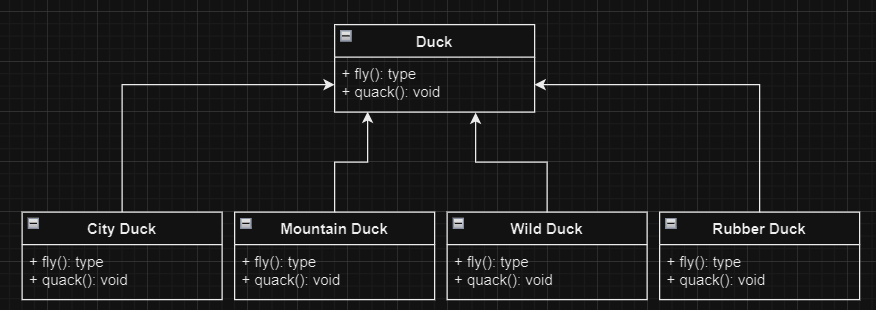
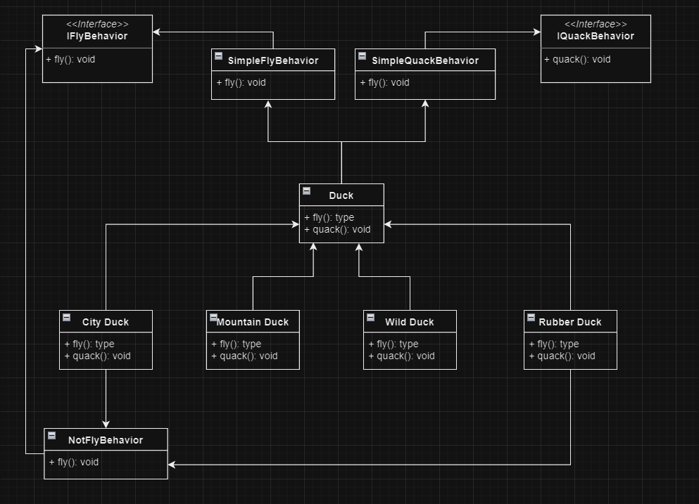

# Strategy Pattern
Strategy Pattern é usado para casos onde é usado um sistema de **Herança**, mas, por algum motivo as classes filhas tem mesmas implementação umas das outras.

Também é usado para quando é preciso mudar uma operação em tempo de execução, usando uma sub-divisão da tarefa. É possível trocar essa sub-divisão (strategy) em tempo de execução para realizar uma operação diferente.

O Strategy Patter se aplica muito bem também em casos onde temos várias lógicas parecidas, porém, com pequenas diferenças. Essas pequenas diferenças podem ser implementadas em Strategies separados. Assim, fica fácil de saber o que cada caso de uso faz.

### Problema

Na imagem seguinte tem 4 tipos de patos diferentes.

Todos são patos, porém, alguns desses patos tem os comportamentos `fly()` e `quack()` diferentes dos outros.

No caso em que o `Rubber Duck` não possa voar e nem grasnar, ele deve reimplementar sua lógica. Seguindo o modelo, fazer isso não é difícil, é só implementar uma nova lógica na classe do `Rubber Duck`.

Mas e se o `Mountain Duck` também não pudesse voar?

- O código seria duplicado para o `Rubber Duck` e o `Mountain Duck`, e também para qualquer outro tipo de pato que não pudesse voar.
- Esse problema pode se aplicar para qualquer propriedade, então pode crescer muito rapidamente a duplicação de código, dependendo do caso.

### Solução com Strategy Pattern

- Criar uma classe para cada método (strategy) que pode ser diferente.
- Organizar usando Interfaces

Mudanças feitas aplicando o design pattern: **Strategy**

- Criado Interfaces para representar as ações: Fly (`IFlyBehavior`) e Quack (`IQuackBehavior`);
- Criado classes para cada tipo diferente de ação: `SimpleFlyBehavior`, `NotFlyBehavior` e `IQuackBehavior` ;
- As classes “Simple” são aplicadas à classe `Duck` , onde terá o comportamento padrão. E as que diferem do comportamento padrão (`NotFlyBehavior` e qualquer outra que quiser criar futuramente) são aplicadas diretamente nas classes “filhas” da `Duck`, no exemplo, são o `Rubber Duck` e a `City Duck`.